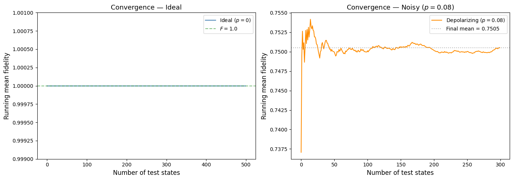
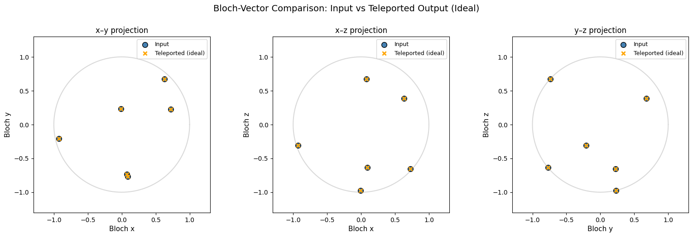
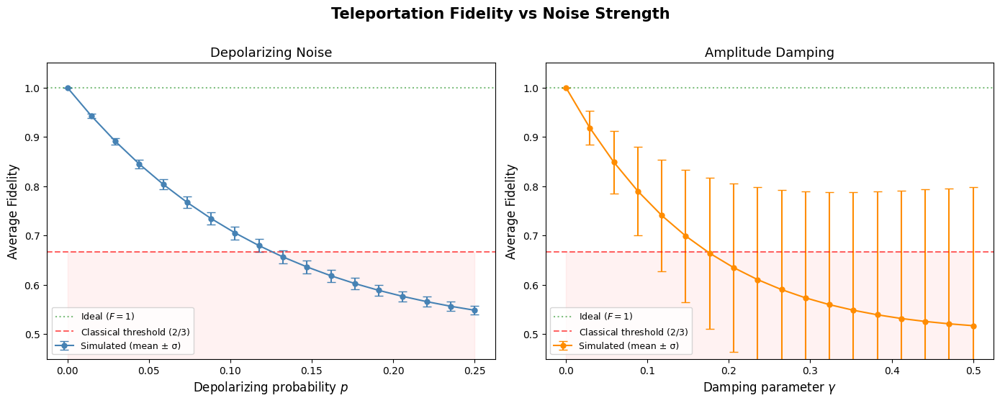
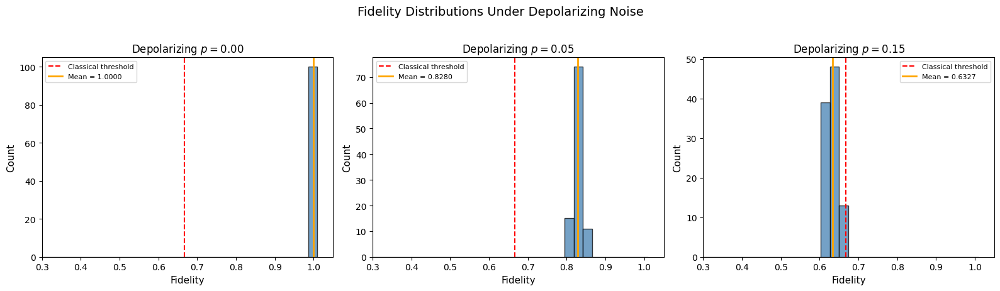

# Quantum Teleportation: Fidelity and Noise Analysis

A computational study of the standard quantum teleportation protocol using **Qiskit**.  
This project implements the full teleportation circuit, verifies correctness across **Haar-random input states**, and studies how teleportation fidelity degrades under realistic quantum noise.

## Overview

Quantum teleportation is a foundational protocol in quantum information. It allows the transfer of an unknown qubit state from one party to another using:

- a shared entangled pair,
- two classical bits of communication,
- and local correction operations.

This notebook investigates both the **ideal noiseless case** and the **noisy case**, with emphasis on fidelity and statistical robustness.

## What this project does

- Implements the standard **3-qubit teleportation circuit**
- Uses **Haar-random single-qubit states** as input
- Verifies near-unit teleportation fidelity in the ideal simulator
- Studies fidelity degradation under:
  - **Depolarizing noise**
  - **Amplitude-damping noise**
- Uses repeated experiments, convergence analysis, and statistical summaries

## Main Results

### 1. Convergence of Mean Fidelity

The simulation verifies stable convergence of the running mean fidelity in both the ideal and noisy settings.  
In the noiseless case, the protocol reaches essentially perfect fidelity, while under depolarizing noise the running average converges to a lower but stable value.

### 2. Input vs Teleported Output on the Bloch Sphere

To verify state transfer geometrically, the notebook compares Bloch-vector coordinates of selected input states against their teleported outputs in the ideal case.  
The overlap between input and output points confirms accurate state reconstruction.

### 3. Fidelity vs Noise Strength

The notebook studies how average teleportation fidelity changes under two realistic noise models: **depolarizing noise** and **amplitude damping**.  
This figure highlights the monotonic degradation of teleportation quality as noise strength increases, and compares the results against the ideal limit and a classical fidelity threshold.

### 4. Fidelity Distributions Under Depolarizing Noise

Beyond average fidelity, the notebook also examines full fidelity distributions at selected depolarizing noise levels.  
This shows how teleportation performance shifts and becomes more concentrated at lower fidelities as noise increases.

## Key outcomes

- Confirms that the teleportation protocol reconstructs the original state with near-perfect fidelity in the noiseless case
- Shows how fidelity decreases as noise strength increases
- Demonstrates the protocol through both theoretical explanation and numerical simulation
- Illustrates both average behavior and full fidelity distributions under noise

## Tools and libraries

- Python
- Qiskit
- Qiskit Aer
- NumPy
- Matplotlib
